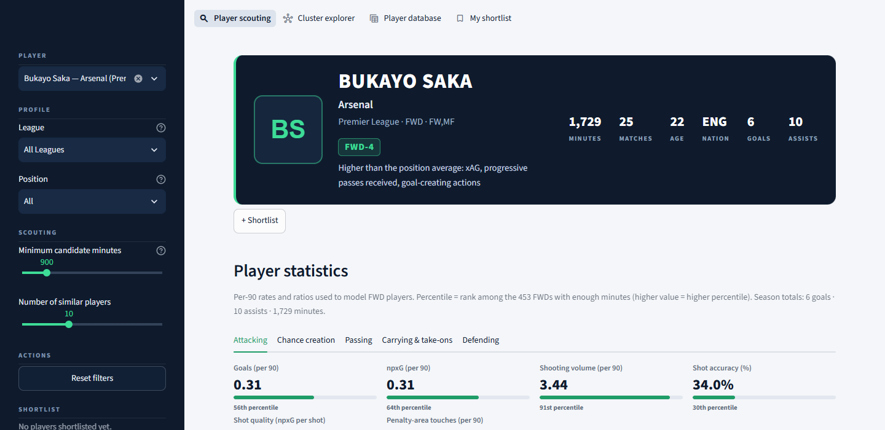
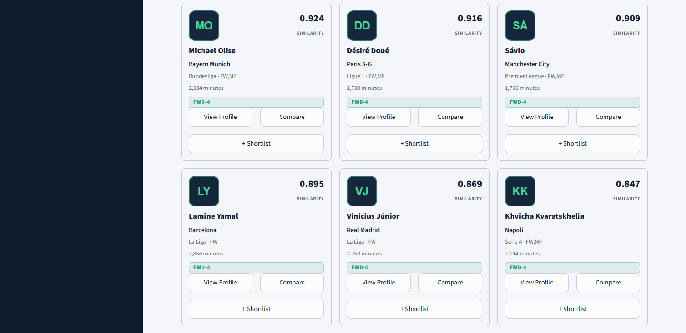
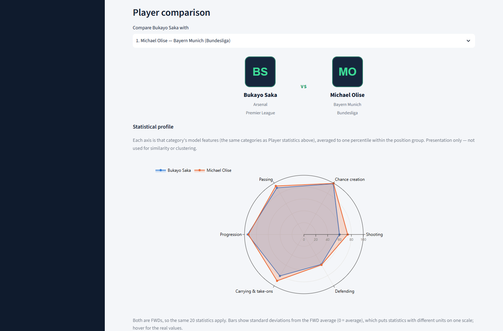
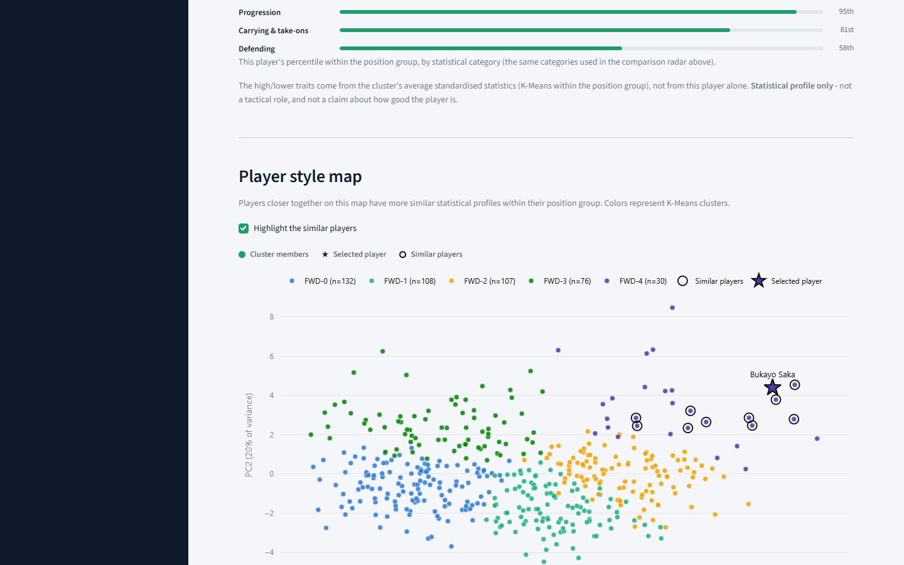
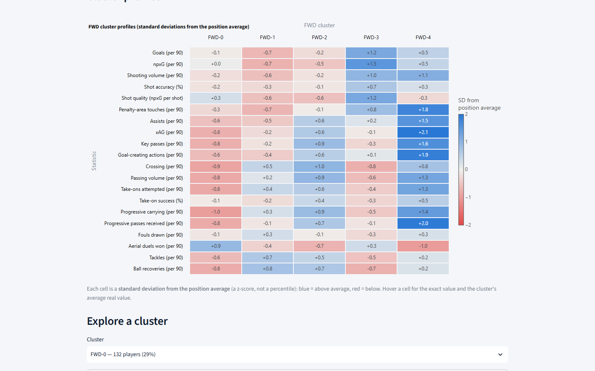
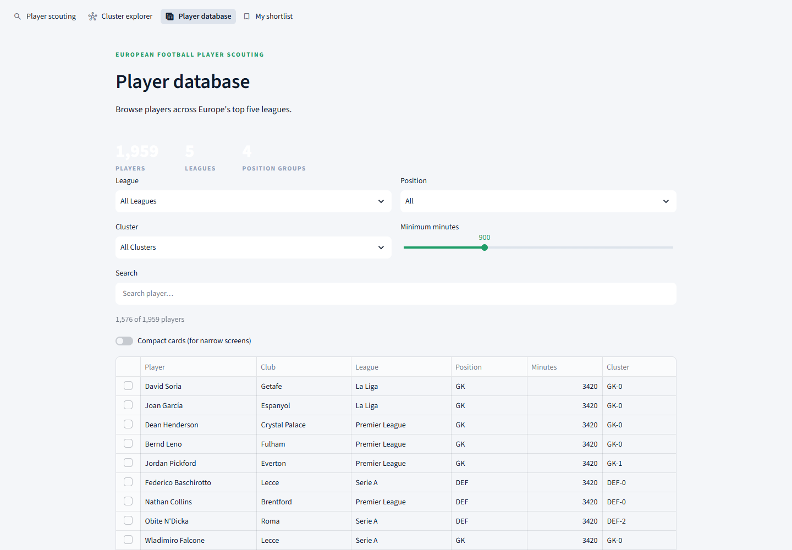
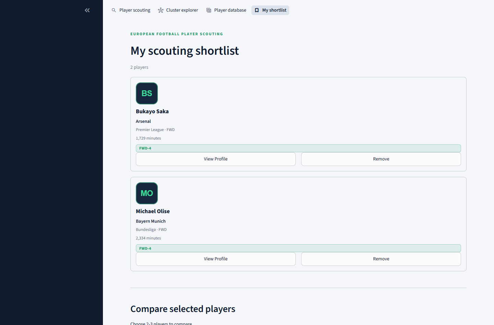
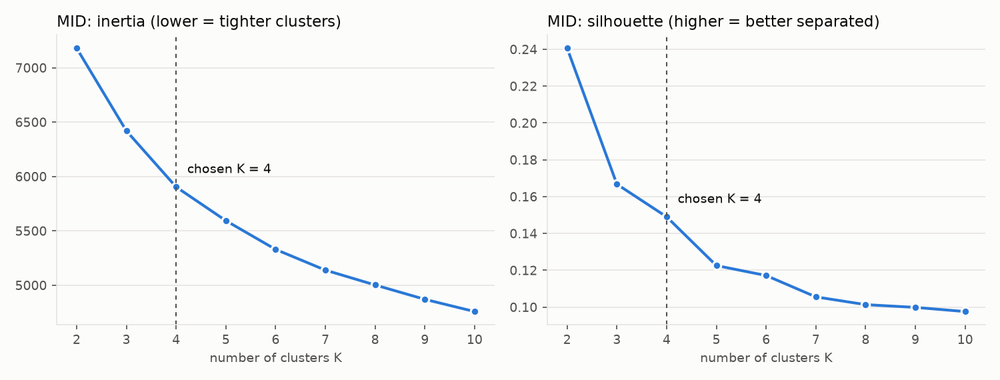
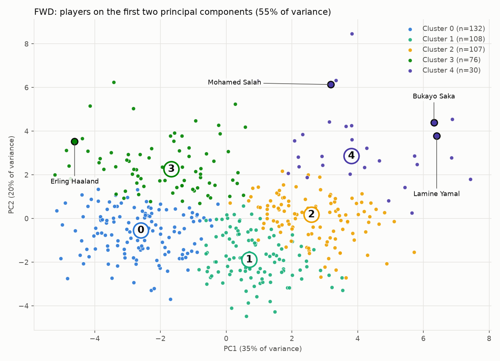

# European Football Player Scouting

> A data-driven football scouting system that identifies statistically similar players, discovers playing-style clusters, and lets you browse, compare and shortlist candidates across Europe's top five leagues.

Search for a player, see their statistical profile, and get the players whose statistics look most like theirs, in any of the Premier League, La Liga, Serie A, Bundesliga or Ligue 1. Explore how the whole player pool splits into playing-style clusters, browse the full player database with filters, and build a scouting shortlist you can compare side by side — all in a single Streamlit application built on a from-scratch data pipeline.

**[Screenshots](#10-screenshots) · [Setup](#12-setup) · [Deployment](#13-deployment)**

- [Overview](#1-overview)
- [Features](#2-features)
- [Tech stack](#3-tech-stack)
- [Architecture](#4-architecture)
- [Pipeline](#5-pipeline)
- [Similarity model](#6-similarity-model)
- [Clustering](#7-clustering)
- [Example results](#8-example-results)
- [Dashboard](#9-dashboard)
- [Screenshots](#10-screenshots)
- [Project structure](#11-project-structure)
- [Setup](#12-setup)
- [Deployment](#13-deployment)
- [Data](#14-data)
- [Limitations](#15-limitations)
- [Future improvements](#16-future-improvements)
- [Running tests](#17-running-tests)
- [Project summary](#18-project-summary)

---

## 1. Overview

Football scouting often starts with a question like *"who else can do what this player does?"*: finding a player who could fill a similar role or offer a similar statistical profile to an existing one.

This project answers that question from data. It uses season statistics for 1,959 players in Europe's five major leagues to:

- **find statistically similar players**, including across leagues;
- **discover statistical player clusters** within each position, from K-Means, not hand-labelled roles;
- **compare players** side by side, with a radar chart, a per-feature breakdown and exact values;
- **explore player profiles**, with percentile statistics and a generated playing-style summary;
- **build scouting shortlists**, saved for the session, with the same comparison view;
- **explore players across leagues**, browsing or filtering the whole modelled pool by league, position, cluster and minutes.

> **What "similar" means here.** The system measures **statistical similarity**: how alike two players' per-90 statistics are after standardising them within a position group. That is a *proxy* for playing style, not a description of it. It does not model complete tactical behaviour — it cannot see tactical role, off-ball movement, instructions, opposition quality or anything else that is not in the statistics, and it says nothing about how *good* a player is. See [Limitations](#15-limitations).

---

## 2. Features

Everything listed here is implemented and covered by the test suite (211 tests — see [Running tests](#17-running-tests)).

**Player scouting**

- **Player search** across all modelled players (searchable list, shareable `?player_id=` links), with a photo or a generated initials avatar.
- **League, position and minimum-candidate-minutes filtering** (defaults: any league, any position, 900+ minutes).
- **Per-90 statistics** with percentiles, grouped into position-relevant categories (Attacking, Chance creation, Passing, Carrying & take-ons, Defending, Goalkeeping) with a compact percentile bar per statistic.
- **Position-specific feature sets**: a goalkeeper is never shown shooting stats, a forward is never shown save %.
- **Cosine-similarity recommendations**, shown as scouting cards (photo, club, league, minutes, cluster, similarity score) with one-click **View Profile** and **Compare**.
- **Cross-league discovery**: a league-mix chart shows where the closest matches actually play.
- **Player comparison**: any two players of the same position group, with a radar chart of percentile-by-category, a per-feature standard-deviation chart, and an exact-value table.
- **Playing-style profile**: which cluster a player belongs to, its size, the broad categories it's stronger in, and this player's own percentile on each of the cluster's defining statistics.
- **Player Style Map**: the PCA projection of the player's position group, with the player highlighted and similar players ringed.

**Cluster explorer**

- Pick a position group and see cluster sizes, a profile heatmap (standardised value per cluster per statistic), and a focused per-cluster view (size, high/lower traits, member list, and the Player Style Map focused on that cluster).

**Player database**

- Browse or search the entire modelled pool with league, position, cluster and minimum-minutes filters, as a sortable table or, on narrow screens, as browsing cards — the same filtered data either way.
- Select a player to view their profile or add them to the shortlist directly from the database.

**Scouting shortlist**

- Add players from a similar-player card, a player's own profile, or the database.
- A session-only shortlist (no login, no database) shown in the sidebar and on its own page, with remove and view-profile actions.
- **Compare selected players**: pick 2–3 shortlisted players and get the same comparison view used everywhere else; incompatible position groups are explained rather than silently skipped or crashed on.

**Engineering**

- **Cached models and data**: everything is loaded once with `st.cache_resource`; nothing is retrained when the app starts.
- **Validation and error handling**: saved artifacts are cross-checked at load (a missing or out-of-sync file shows what to rebuild); unknown players, empty results, missing optional metadata (such as age) and bad links are handled without errors.

**Modelling code (`src/scouting/`)**

- **Position-specific feature sets** for GK, DEF, MID and FWD, with per-90 rates and smoothed efficiency ratios.
- **Cosine similarity** within a position group, with an optional league filter and a candidate-minutes filter.
- **Euclidean distance** as a *secondary diagnostic* (`metric="euclidean"` and `SimilarityEngine.compare_metrics`). It is available in code and in `scripts/inspect_similarity.py`; it is not shown in the dashboard.
- **K-Means clustering** per position group, with K evaluated by inertia, silhouette and seed stability.
- **Cluster profiles** (mean and median standardised value of every feature per cluster).
- **PCA** to two dimensions for visualisation.

---

## 3. Tech stack

```text
Python  ·  Pandas  ·  NumPy  ·  Scikit-learn  ·  Matplotlib  ·  Plotly  ·  Streamlit  ·  Joblib
```

Also used: **PyYAML** (configuration), **kagglehub** and **python-dotenv** (one-time dataset download), **pytest** (211 tests).

Machine-learning and analysis techniques:

| Technique | Where it is used |
|---|---|
| `StandardScaler` | z-scores every feature, fitted separately for each position group |
| Cosine similarity | the primary player-similarity metric |
| K-Means | playing-style clusters, one model per position group |
| PCA | 2-D map of the standardised feature space (the "Player Style Map") |
| Silhouette analysis | how well separated the clusters are, for K = 2 to 10 |
| Cluster stability (adjusted Rand index, ARI) | whether the same clusters appear with different random seeds |
| `log1p` transform | reduces right skew in selected count features before scaling |

---

## 4. Architecture

```text
                        PLAYER DATA (Kaggle / FBref)
                                  │
                                  ▼
                        DATA PREPROCESSING
                     (clean, dedupe, merge teams)
                                  │
                                  ▼
                       FEATURE ENGINEERING
              (per-90 rates, ratios, position feature lists,
                    log1p, StandardScaler — saved)
                                  │
                  ┌───────────────┴───────────────┐
                  ▼                               ▼
          Similarity Pipeline                K-Means Clustering
        (cosine similarity within          (one model per position
           a position group)                group, K chosen by
                  │                       silhouette + stability)
                  ▼                               ▼
           Similar Players                  Cluster Profiles
                  │                               │
                  └───────────────┬───────────────┘
                                  ▼
                             PCA (2-D)
                     saved coordinates for every
                        modelled player
                                  │
                                  ▼
                      STREAMLIT DASHBOARD
                    (reads saved outputs only;
                      nothing is retrained)
                                  │
        ┌─────────────┬──────────┴──────────┬─────────────┐
        ▼             ▼                     ▼             ▼
   Player          Cluster              Player         My
   Scouting        Explorer             Database       Shortlist
```

The pipeline (top half) runs offline, once, and saves its outputs to `data/processed/` and `models/`. The dashboard (bottom half) only ever *reads* those saved files — starting the app never retrains a model or recomputes a similarity score.

---

## 5. Pipeline

```text
Raw player data
      ↓
Data cleaning
      ↓
450-minute eligibility filter
      ↓
Per-90 feature engineering
      ↓
Position-specific feature selection
      ↓
Log transformations
      ↓
StandardScaler
      ↓
Cosine similarity  +  K-Means clustering
      ↓
PCA visualisation
      ↓
Streamlit dashboard
```

| Step | What happens | Code |
|---|---|---|
| Raw data | The 2024-25 player table (267 columns, 2,854 rows) is downloaded from Kaggle. | `src/scouting/clean/download.py` |
| Data cleaning | Repeated columns are verified identical and dropped, the ambiguous ones (for example `Blocks`, `Off`, `Fld`) are renamed explicitly, league and nation prefixes are split off, and only additive season totals are kept. Players who appear for two teams are merged on name plus birth year (147 rows merged, giving 2,707 players). | `src/scouting/clean/data_preprocessing.py`, `src/scouting/clean/columns.py` |
| Minimum minutes | Players need **450 minutes** to be modelled, leaving 1,959 players. | `src/scouting/features/engineering.py` |
| Per-90 features | Totals become rates per 90 minutes; efficiency ratios are added. | `src/scouting/features/engineering.py` |
| Feature selection | Each position group uses its own feature list. | `config.yaml` |
| Log transform | `log1p` on features that are non-negative and strongly right-skewed within their group. | `src/scouting/features/scaling.py` |
| StandardScaler | z-scores per position group; the fitted scalers are saved. | `src/scouting/features/scaling.py` |
| Similarity | Cosine similarity inside each position group. | `src/scouting/similarity.py` |
| K-Means, PCA | One K-Means and one PCA per position group; assignments, profiles, coordinates and models are saved. | `src/scouting/clustering.py` |
| Dashboard | Reads the saved outputs only. | `app.py`, `src/scouting/dashboard/` |

**Why per-90 statistics.** Season totals mostly measure playing time: a player with 3,000 minutes will out-accumulate one with 1,000 even if the second is more productive. Dividing by minutes played (in units of 90) puts players on a comparable footing. Ratios such as pass completion or take-on success are computed from the totals and are *smoothed* toward the position group's average (a prior worth 10 attempts), so a player who went one-for-one on take-ons does not read as 100% and a player with no attempts gets the group average instead of a division by zero.

**Why position-specific feature sets.** A goalkeeper's useful statistics (save percentage, sweeping, distribution) have nothing in common with a striker's (shot quality, penalty-area touches), and even outfield roles are described by different things. Forcing one feature set on everyone would fill the comparison with irrelevant, mostly-zero columns. So each group has its own list:

| Group | Players (≥ 450 min) | Features | `log1p` applied to |
|---|---|---|---|
| GK | 154 | 6 | 1 |
| DEF | 748 | 19 | 4 |
| MID | 604 | 16 | 5 |
| FWD | 453 | 20 | 10 |

The full lists are in [`config.yaml`](config.yaml) (`modeling.position_feature_lists` and `modeling.log1p_features`). No manual feature weights are applied.

**Why standardisation is required.** Cosine similarity and K-Means both operate on distances or angles in feature space, and raw statistics live on completely different scales (a percentage from 0–100 next to a per-90 count that rarely exceeds 5). Without standardising every feature to a z-score first, the largest-magnitude statistics would dominate both the similarity score and the cluster assignment regardless of how informative they actually are.

**Why cosine similarity.** It compares the *shape* of two standardised profiles — which statistics a player leans on relative to the position average — rather than their absolute magnitude. That makes it robust to a player being an "intense" or "quiet" version of a profile: a squad player and a starter with the same statistical shape still score highly, which is closer to the "who plays like this?" question than a magnitude-sensitive metric would be.

**Why K-Means is fit separately per position.** A goalkeeper and a forward are described by different feature lists entirely, so they can never share one feature space, let alone one set of clusters. Fitting one K-Means per position group is the only way clustering can respect that.

**Why PCA is only a visualisation technique.** PCA is used exclusively to project each already-standardised, already-clustered position group down to two dimensions for the "Player Style Map" scatter plot. It is never an input to similarity or to K-Means, and distance on that 2-D map is only an approximation of the real, higher-dimensional similarity — never a substitute for the cosine similarity score itself.

---

## 6. Similarity model

Each player is a vector of standardised statistics, one z-score per feature in their position group's list (0 means the position-group average). **Cosine similarity** compares the *direction* of two such vectors: do the two players lean the same way relative to the average, on the same features? A score of 1 means the vectors point the same way, 0 means unrelated, and −1 means opposite.

> **Similarity scores are not probabilities or percentages.**
>
> ```text
> Cosine similarity = 0.92
> ```
>
> means the two players' statistical vectors are highly aligned according to the model. It does **not** mean:
>
> ```text
> 92% identical players
> ```
>
> A cosine similarity of 0.87 does not mean "87% similar", and it says nothing about how good either player is. The dashboard always shows scores as plain numbers (for example `0.924`), never as a percentage.

Rules the engine follows:

- **Players are compared only within compatible position groups.** A goalkeeper is never compared with an outfielder, a defender with a midfielder, and so on. Asking for a different group raises an error.
- The **query player** only needs to be in the modelled pool (450+ minutes). **Candidates** use the **900-minute default filter**; this is adjustable (`min_candidate_minutes`) and guards against noisy small samples.
- An optional **league filter** restricts the candidates to one league; the query player may come from any league, which is what makes cross-league scouting possible.
- Results exclude the query player, are sorted by score, and break ties deterministically.

```python
from scouting.similarity import SimilarityEngine

engine = SimilarityEngine.from_config()
pid = engine.find_id("Bukayo Saka")
engine.find_similar_players(pid, n=10, min_candidate_minutes=900, leagues="La Liga")
```

Cosine similarity ignores how *extreme* a player is: a modest player with a striker's shape scores well against an elite striker. As a diagnostic, `metric="euclidean"` ranks by overall distance instead, and `SimilarityEngine.compare_metrics` shows how the two rankings differ. Neither is presented as "better"; the dashboard uses cosine similarity.

---

## 7. Clustering

Players are clustered with **K-Means, separately for each position group**, on the same standardised matrices used for similarity. A goalkeeper never shares a feature space with a forward.

```text
GK  → K=2
DEF → K=5
MID → K=4
FWD → K=5
```

**How K was chosen.** K was evaluated from 2 to 10 using the project's existing evaluation process: inertia, silhouette score, cluster stability across random seeds (adjusted Rand index, ARI), cluster sizes and whether the clusters have distinct, interpretable profiles. Silhouette alone was not used to decide, because it favours K=2 in every group (the single biggest split). Instead, K is the largest value whose clusters are reproducible across seeds (ARI ≥ 0.90, and ≥ 0.95 for goalkeepers, which have only six features), with no cluster under 5% of its group and clearly different feature profiles. The choice was made without reference to any individual player's assignment, and the full rationale is recorded in [`config.yaml`](config.yaml).

| Group | K | Silhouette | Stability (ARI) | Cluster sizes |
|---|---|---|---|---|
| GK | 2 | 0.18 | 0.97 | 86, 68 |
| DEF | 5 | 0.12 | 0.96 | 239, 151, 150, 105, 103 |
| MID | 4 | 0.15 | 0.97 | 224, 142, 137, 101 |
| FWD | 5 | 0.13 | 0.95 | 132, 108, 107, 76, 30 |

**Silhouette scores are relatively low** (0.12 to 0.18). That is expected: player profiles form a continuum rather than perfectly separated groups, so clusters overlap and a player near a boundary could sit in a neighbouring cluster. The clusters are best read as *statistical tendencies* (which statistics dominate), never as objectively correct player roles. Stability is high, meaning the same clusters come back with different random seeds up to the chosen K.

Clusters are described from data, never named by hand: a feature counts as **high** when the cluster's mean z-score is at least +0.5 and **lower** when it is at most −0.5. The dashboard builds its descriptions from [`cluster_profiles.csv`](data/processed/2024-2025/cluster_profiles.csv). Cluster ids are ordered by size (0 is the largest) and only mean something within their own position group.

---

## 8. Example results

These come from the saved 2024-25 outputs with the default settings (candidates need 900+ minutes). They are illustrations, not validation: there is no ground truth for "similar player", so judge them with football knowledge.

### Bukayo Saka: FWD · cluster FWD-4

Arsenal, Premier League, 1,729 minutes. FWD-4 is the smallest forward cluster (30 players, 7%): **high** xAG (+2.1), progressive passes received (+2.0), goal-creating actions (+1.9), penalty-area touches (+1.8) and key passes (+1.6); **lower** aerial duels won (−1.0). In short, high chance creation and attacking involvement. Closest matches: Michael Olise (0.924), Désiré Doué (0.916), Sávio (0.909), Lamine Yamal (0.895), Vinícius Júnior (0.869). Nine of his top ten play outside the Premier League.

### Erling Haaland: FWD · cluster FWD-3

Manchester City, Premier League, 2,736 minutes. FWD-3 (76 players) is a finishing-oriented profile: **high** npxG (+1.5), shot quality (+1.2), goals (+1.2), shooting volume (+1.0); **lower** crossing, ball recoveries, passing volume and tackles. Closest matches: Cristhian Stuani (0.890), Patrik Schick (0.868), Ermedin Demirović (0.859), Alexander Sørloth (0.842), Myron Boadu (0.839). All five share the finishing profile: their npxG per 90 ranges from 0.48 to 0.92, against 0.62 for Haaland and 0.29 for the average forward.

### Declan Rice: MID · cluster MID-2

Arsenal, Premier League, 2,825 minutes. MID-2 (137 players) shows **high** progressive passing (+1.1), passing volume (+1.0), ball recoveries (+0.8) and pass completion (+0.6), with nothing markedly lower. Closest matches: Thiago Almada (0.843), Hakan Çalhanoğlu (0.832), Julian Brandt (0.819), Fabián Ruiz (0.804), Lucas Da Cunha (0.789). Worth knowing: these are mostly advanced, progression-heavy midfielders. Rice's own tackle and interception rates are *below* the midfielder average in this data (which may partly reflect Arsenal's high possession; see [Limitations](#15-limitations)), and the classic ball-winners in the dataset (for example Casemiro, Zubimendi, Caicedo) fall in MID-0.

### Virgil van Dijk: DEF · cluster DEF-2

Liverpool, Premier League, 3,330 minutes. DEF-2 (150 players) is a ball-playing defender profile: **high** passing volume (+1.2), pass completion (+0.9), progressive passing (+0.9), aerial win rate (+0.5); **lower** crossing and attacking-third touches. Closest matches: Karol Mets (0.867), Stefan de Vrij (0.804), Jonathan Tah (0.775), Philipp Lienhart (0.768), Eric Dier (0.762).

### Alisson: GK · cluster GK-0

Liverpool, Premier League, 2,508 minutes. GK-0 (86 goalkeepers) is defined by *lower* passing volume and progressive pass distance; it has no strongly high traits, and the two goalkeeper clusters differ mainly in distribution style. Closest matches: Rui Silva (0.889), Péter Gulácsi (0.818), Alex Meret (0.807), Kepa Arrizabalaga (0.787), Wojciech Szczęsny (0.753). Goalkeeper results rest on only six statistics and 154 players, so treat them as the weakest in the project.

---

## 9. Dashboard

Start it with `streamlit run app.py` (see [Setup](#12-setup)). Four pages, all built on the same saved pipeline outputs and the same `st.session_state`-based navigation — a player selected anywhere in the app (a card, the database, the shortlist) opens the same Player Scouting page.

### Player Scouting

Sections appear in this order once a player is selected:

1. **Player profile**: photo (or a generated initials avatar), name, club, league, position and group, minutes, cluster badge, plus age, matches, nation, goals and assists when available; a shortlist button right below.
2. **Statistics**: the position-specific statistics in tabs, each as a compact card with the real value and a percentile bar.
3. **Similar players**: scouting cards (photo, club, league, minutes, cluster, cosine similarity) with **View Profile**, **Compare** and **+ Shortlist** on every card, plus a collapsible league-mix chart.
4. **Player comparison**: pick any of the similar players; a photo header, a percentile-by-category radar chart, a per-feature standard-deviation chart and an exact-value table.
5. **Playing style**: the player's cluster, its size, the broad statistical categories it's higher in, this player's own percentile on each defining statistic, and a compact per-category percentile summary.
6. **Player Style Map**: the saved PCA projection of the player's position group, coloured by cluster, with the selected player and the similar players highlighted, a legend, and a "how to read this map" note.

### Cluster explorer

Pick a position group (GK, DEF, MID or FWD) to see:

- **Cluster sizes** and the number of players and clusters;
- **Cluster profiles** as a heatmap of average standardised statistics (blue above the position average, red below — explicitly labelled as standard deviations, not percentiles);
- **Explore a cluster**: pick one cluster to see its size, high/lower features, member list (with league and minutes filters), and the Player Style Map focused on it.

A **Limitations** section, including the team-style caveat, is shown on every page.

### Player database

- Real-time counts (players, leagues, position groups) at the top.
- League, position, cluster and minimum-minutes filters, plus a name search.
- A sortable table (with row selection to reveal View Profile / Shortlist actions) or, toggled, browsing cards for narrow screens — both read the same filtered data.

### My shortlist

- Players added from anywhere in the app, shown as cards with View Profile and Remove.
- **Compare selected players**: a multiselect (capped at three) drives the same comparison view as the Player Scouting page; incompatible position groups get an explanation instead of a crash.
- Session-only (`st.session_state["shortlist"]`) — it survives reruns within a session but is not saved anywhere; refreshing the browser or restarting the app clears it. See [Future improvements](#16-future-improvements).

---

## 10. Screenshots

| Player profile | Similar players |
|---|---|
|  |  |

| Player comparison | Player Style Map |
|---|---|
|  |  |

| Cluster explorer | Player database |
|---|---|
|  |  |

| Shortlist |
|---|
|  |

The pipeline's own static figures (K-selection and PCA plots for every position group, produced by `python -m scouting.clustering evaluate/fit`) are also in the repository under [`reports/2024-2025/`](reports/2024-2025/), for example:

| K selection (MID) | PCA map (FWD) |
|---|---|
|  |  |

---

## 11. Project structure

```text
.
├── app.py                        Streamlit entry point (4 pages via st.navigation)
├── config.yaml                   season, data source, features, K values, log1p lists
├── requirements.txt
├── pyproject.toml                makes the `scouting` package installable (pip install -e .)
├── .streamlit/config.toml        theme (dark sidebar, light content)
├── .env                          local Kaggle token (git-ignored; only needed to rebuild the raw data)
│
├── src/scouting/
│   ├── config.py                 typed loader for config.yaml, plus data/model/report paths
│   ├── clean/                    download.py, columns.py, data_preprocessing.py
│   ├── features/                 engineering.py (per-90, ratios, filter), scaling.py (log1p, scaler)
│   ├── similarity.py             SimilarityEngine and find_similar_players()
│   ├── clustering.py             K selection, K-Means, profiles, PCA, saved outputs
│   ├── visualization.py          Matplotlib elbow and PCA figures for reports/
│   ├── palette.py, labels.py     shared chart colours; readable feature names, categories and the
│   │                             comparison-radar's category regrouping
│   ├── dashboard/                data.py (load + validate), logic.py, charts.py, components.py,
│   │                             photos.py, theme.py, views.py (all 4 pages)
│   └── utils/                    logging helper
│
├── data/
│   ├── raw/2024-2025/            downloaded Kaggle CSV
│   ├── interim/2024-2025/        players_clean.csv
│   ├── metadata/                 player_photos.csv (optional, hand-maintained; empty template by default)
│   └── processed/2024-2025/      features, model matrices, K-Means evaluation,
│                                 cluster assignments and profiles, PCA coordinates
├── models/2024-2025/             scalers.joblib, kmeans.joblib, pca.joblib
├── reports/2024-2025/            elbow_<GROUP>.png, pca_<GROUP>.png
├── docs/screenshots/             dashboard screenshots used in this README
├── scripts/                      inspect_features.py, inspect_similarity.py, inspect_clusters.py
│                                 (print review reports; not part of the test suite)
└── tests/                        pytest suite, 211 tests (see Running tests)
```

`data/raw/` only contains the 2024-25 file the pipeline actually uses; two unused 2025-26 exploration files (see [Data](#14-data)) and the dormant live-scraping client that preceded the Kaggle dataset have been removed as part of the Phase 5 cleanup.

---

## 12. Setup

Requires Python 3.10 or newer (`pyproject.toml`); developed and tested on Python 3.13.

```bash
# 1. get the project
git clone https://github.com/UkatoSpeaks/Football-Scouting-Agent.git
cd Football-Scouting-Agent

# 2. create and activate a virtual environment
python -m venv .venv
source .venv/bin/activate            # macOS / Linux
# .venv\Scripts\Activate.ps1         # Windows PowerShell

# 3. install dependencies and the `scouting` package
pip install -r requirements.txt
pip install -e .

# 4. start the dashboard
streamlit run app.py
```

The app opens at <http://localhost:8501>. On Windows without activating the environment: `.venv\Scripts\python.exe -m streamlit run app.py`.

**`data/processed/` and `models/` are already committed to this repository**, so step 4 is all you need — there is no rebuild step, no Kaggle token and no environment variable required just to run the dashboard. If you do want to rebuild the pipeline outputs from scratch (for example after changing `config.yaml`):

```bash
python -m scouting.clean.data_preprocessing   # downloads the raw data if missing, then cleans it
python -m scouting.features.engineering       # per-90 features, 450-minute filter
python -m scouting.features.scaling           # log1p + StandardScaler, saves scalers
python -m scouting.clustering evaluate        # optional: K = 2..10 evaluation and elbow plots
python -m scouting.clustering fit             # K-Means, PCA, profiles, assignments, figures
```

The download step needs a Kaggle API token. Put it in a `.env` file in the project root (this file is git-ignored):

```text
KAGGLE_API_TOKEN=<your-token>
```

If `data/raw/2024-2025/players_data-2024_2025.csv` already exists, nothing is downloaded and no token is needed. All steps use fixed random seeds (`modeling.random_state: 42`). Rebuilding reproduces the features, model matrices, cluster assignments, cluster profiles and PCA coordinates exactly; the K-Means evaluation table (`kmeans_evaluation.csv`) can differ in the last floating-point digits between runs.

---

## 13. Deployment

The app is ready to deploy as-is: it needs no database, no backend, no authentication and — because the pipeline outputs are already committed — no environment variables or secrets at runtime.

**Streamlit Community Cloud** (recommended, free):

1. Push this repository to GitHub (already the case if you're reading this there).
2. On [share.streamlit.io](https://share.streamlit.io), create a new app pointing at this repository, branch `main`, main file `app.py`.
3. Leave "Secrets" empty — nothing is required. If you ever want the app itself to be able to rebuild the raw data, add `KAGGLE_API_TOKEN` there instead of committing `.env`.
4. Deploy. The platform installs `requirements.txt` and runs `streamlit run app.py` for you.

**Any other host that can run a long-lived Python process** (Render, Railway, a VM, Docker, …): install `requirements.txt` and `pip install -e .`, then run `streamlit run app.py --server.port $PORT --server.address 0.0.0.0` (most platforms inject `$PORT`; check the host's docs for the exact variable).

What was checked to make this true:

- **`requirements.txt`** lists only what the application and pipeline actually import — nothing installed for local testing/screenshotting (Playwright, Kaleido) is in it, because the app never imports them.
- **Paths** are computed from `Path(__file__).resolve()` in [`config.py`](src/scouting/config.py), never hard-coded to a machine — the app works from any clone location, unchanged.
- **`.streamlit/config.toml`** sets only the theme and `gatherUsageStats = false`; it does not pin a host-specific port, so it doesn't fight a cloud platform's own port injection.
- **Model and data file paths** all resolve relative to the project root and are all present in the repository, so a fresh clone has everything the dashboard reads.
- **No external image URLs** are hard-coded: player photos come only from the optional, git-tracked `data/metadata/player_photos.csv` (empty by default), and every player without an entry gets a generated initials avatar — the app never breaks on a missing or unreachable image.
- **No environment variables** are read by the dashboard itself; `KAGGLE_API_TOKEN` is only read by the optional rebuild step.

Not done automatically, and not required to use the app: an actual deployment to Streamlit Cloud (or any other host) — that's a one-time action for you to trigger with the steps above.

---

## 14. Data

- **Source.** Player statistics come from **FBref**, obtained through the Kaggle dataset [`hubertsidorowicz/football-players-stats-2024-2025`](https://www.kaggle.com/datasets/hubertsidorowicz/football-players-stats-2024-2025) (file `players_data-2024_2025.csv`), as configured in `config.yaml`. Check the dataset page for its licence and terms before reusing or redistributing the data.
- **Season.** **2024-2025**, a complete season.
- **Leagues.** Premier League, La Liga, Serie A, Bundesliga and Ligue 1.
- **Coverage.** 2,854 raw rows become 2,707 players after merging players who appeared for two teams; **1,959** have the **450 minutes** needed for model eligibility (748 DEF, 604 MID, 453 FWD, 154 GK).
- **Thresholds.** 450 minutes to be modelled; **900 minutes** by default for similar-player *candidates* (adjustable in the dashboard).
- **Why 2024-25 and not the latest season.** FBref removed its advanced statistics (passing, possession, defending, shot creation) in January 2026, and the site is behind a Cloudflare challenge. The 2025-26 dataset on Kaggle therefore has basic statistics only, which is not enough for these features. Two 2025-26 CSVs and the original live-scraping client that predated the Kaggle dataset were left over from that exploration; both were removed in the Phase 5 repository cleanup since the pipeline never used them.

---

## 15. Limitations

**Team style.** Per-90 statistics still reflect team context and possession style. A midfielder at a high-possession club records fewer tackles and interceptions per 90 than a similar player at a team that defends more, and passing and touch counts inflate the other way. The project does not correct for this, so some similarities and clusters partly reflect the team, not just the player.

**Statistical similarity is not tactical similarity.** Two players can have similar statistics while playing different roles, and two players in the same role can have different statistics. The model sees only the numbers in the dataset: no video, off-ball movement, instructions or opposition strength.

**League differences are not fully normalised.** Statistics are standardised across all five leagues together, so differences in league style and intensity are still present in the numbers.

**K-Means and cluster interpretation.** Player profiles form a continuum, so clusters overlap (silhouette 0.12 to 0.18) and boundaries are fuzzy. K-Means also assumes roughly round clusters, and some separations follow intensity as much as style (for example the small FWD-4 cluster). Clusters represent **statistical groupings**, not objectively correct player roles — they are never presented as tactical positions or scouting verdicts.

**Goalkeepers.** The goalkeeper feature space is small (six features, 154 players) and mostly reflects distribution style, so both clustering and similarity are weaker there than for outfield players.

**Sample size.** Low-minute players produce noisy statistics. That is why players need 450 minutes to be modelled and why similar-player candidates default to 900+ minutes; even so, a single season is a limited sample.

**Shortlist is session-only.** It lives in `st.session_state`, so it survives page interaction within a session but resets when the app restarts or the browser session ends — there is no account or saved storage (see [Future improvements](#16-future-improvements)).

Also: results cover one season (2024-25); position groups are broad (GK, DEF, MID, FWD from the first listed position, with no separate winger or full-back label).

---

## 16. Future improvements

None of these is implemented yet.

- Adjust statistics for **team possession** and style.
- **Normalise across leagues.**
- **Role classification** within position groups (for example winger versus striker, full-back versus centre-back).
- **More seasons**, including trends over time.
- **More advanced similarity methods** beyond cosine and Euclidean distance.
- **Persistent shortlists** (saved beyond the browser session, e.g. exportable or account-based).
- **Age and transfer-value filters.**
- **Tactical or event-level data.**
- **Automated deployment** (CI, packaged data/model releases).

---

## 17. Running tests

```bash
python -m pytest tests -q
```

The suite has **211 tests** and takes about 45 seconds. It covers data cleaning, feature engineering, scaling, the similarity engine, clustering and every dashboard page (exercised headlessly with Streamlit's `AppTest`, including a full end-to-end run of the search → shortlist → compare workflow through the real multipage app). Tests that need the built pipeline outputs are skipped automatically if `data/processed/` and `models/` are missing; run the [rebuild steps](#12-setup) first to include them.

| File | Tests | Covers |
|---|---|---|
| `test_data_preprocessing.py` | 7 | raw column cleaning, team merging |
| `test_feature_engineering.py` | 8 | per-90 rates, minutes filter, ratios |
| `test_scaling.py` | 6 | log1p, StandardScaler |
| `test_similarity.py` | 39 | `SimilarityEngine`, cosine/Euclidean, filters |
| `test_clustering.py` | 15 | K selection, K-Means, PCA, profiles |
| `test_dashboard.py` | 50 | core dashboard logic, charts, similar players, comparison |
| `test_dashboard_phase1.py` | 27 | theme, sidebar, landing, photos, hero |
| `test_dashboard_phase2.py` | 17 | statistics cards, similar-player cards, radar chart |
| `test_dashboard_phase3.py` | 16 | playing style, Player Style Map, cluster explorer |
| `test_dashboard_phase4.py` | 26 | Player Database, Shortlist, end-to-end workflow |

The `scripts/inspect_*.py` files print review reports (feature distributions, similarity diagnostics, cluster profiles) and are not part of the test suite:

```bash
python scripts/inspect_features.py
python scripts/inspect_similarity.py
python scripts/inspect_clusters.py
```

---

## 18. Project summary

**Project statistics**

| | |
|---|---|
| Players modelled | 1,959 (of 2,707 cleaned, 2,854 raw) |
| Leagues | 5 |
| Position groups | 4 (GK, DEF, MID, FWD) |
| Model features | GK 6 · DEF 19 · MID 16 · FWD 20 |
| K (clusters per group) | GK 2 · DEF 5 · MID 4 · FWD 5 |
| Tests | 211 |

**Technical stack**

Python · Pandas · NumPy · Scikit-learn · Matplotlib · Plotly · Streamlit · Joblib

**ML methods**

- Feature engineering (per-90 rates, smoothed ratios, position-specific selection)
- `StandardScaler` (per position group)
- Cosine similarity (primary similarity metric)
- K-Means (per position group)
- PCA (2-D visualisation only)
- Silhouette analysis (K selection)
- Cluster stability analysis (adjusted Rand index across seeds)

**Limitations** — see the full [Limitations](#15-limitations) section: team style is not corrected for, statistical similarity is not tactical similarity, league differences are not fully normalised, goalkeeper modelling is weaker (smaller feature space), low-minute players can be noisy, and clusters are statistical groupings, not objective player roles.
